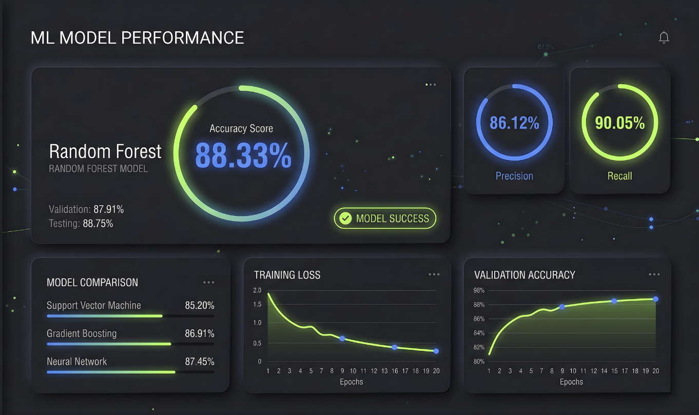

# ❤️ Heart Disease Prediction AI


[](https://www.python.org/)
[](https://scikit-learn.org/)
[](https://flask.palletsprojects.com/)
[]()

This project leverages **Advanced Machine Learning** to predict the likelihood of heart disease in patients based on 14 medical attributes. Using the **Random Forest** algorithm, we achieve high-precision results to aid in early diagnosis and health management.

---

## 🚀 Project Overview

Heart disease remains one of the leading causes of mortality globally. This AI-powered solution analyzes critical health metrics like **resting blood pressure**, **cholesterol levels**, and **maximum heart rate** to provide a rapid risk assessment.

### 🌟 Key Features
- **High-Precision Prediction**: Achieves **88.33% accuracy** in binary classification (Sick vs. Healthy).
- **Comprehensive Feature Analysis**: Identifies top risk factors like Chest Pain type (cp) and Thalassemia (thal).
- **Interactive Web Interface**: A sleek Flask-based UI for real-time patient data input.
- **Robust Preprocessing**: Handles missing values and data normalization for reliable results.

---

## 📊 Performance & Insights



The project underwent rigorous testing using various classification models. **Random Forest** consistently outperformed others, particularly in binary classification tasks.

| Classification Type | Model Used | Accuracy | Precision | Recall | F1-Score |
|:---:|:---:|:---:|:---:|:---:|:---:|
| **Binary (Healthy/Sick)** | **Random Forest** | **88.33%** | 0.86 | 0.88 | 0.87 |
| **Multi-class (Risk levels)** | Random Forest | 60.00% | 0.54 | 0.60 | 0.56 |

### 🔍 Top Risk Indicators
Based on our model's **Feature Importance** analysis, these are the strongest predictors:


1. **Chest Pain type (cp)**: Often the highest indicator of clinical risk.
2. **Number of major vessels (ca)**: Crucial diagnostic metric from fluoroscopy.
3. **Thalassemia (thal)**: A significant genetic factor in our dataset.

---

## 🔧 Installation & Usage

### 1. Environment Setup
```bash
# Clone the repository
git clone <repository-url>
cd ML-Heart-Disease-Prediction

# Create virtual environment
python -m venv venv
source venv/bin/activate  # On Windows: venv\Scripts\activate

# Install dependencies
pip install -r requirements.txt
```

### 2. Running the Analysis
To dive into the research and model training pipeline:
```bash
jupyter notebook heart_disease_analysis.ipynb
```

### 3. Launching the Web App
```bash
python app.py
```
Visit `http://localhost:5000` to interact with the prediction engine.

---

## 📂 Project Structure

```text
ML-Heart-Disease-Prediction/
├── assets/                  # Images and banners
├── data/                    # Dataset (heart_disease.csv)
├── models/                  # Saved .pkl model files
├── templates/               # Web UI components
├── heart_disease_analysis.ipynb  # Core ML research
└── app.py                   # Flask Application
```

## 🛠️ Built With
- **Algorithms**: Random Forest, Logistic Regression
- **Libraries**: Pandas, NumPy, Scikit-learn, Seaborn, Matplotlib
- **Web Framework**: Flask

---

> [!NOTE]
> This tool is for educational purposes and should not be used as a substitute for professional medical advice.
